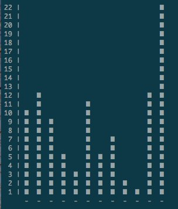
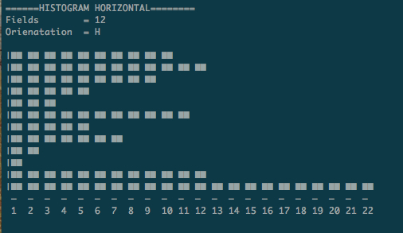

hist FORK
=========

Example from test.c file

    /*Testing data sets*/

    struct histogram *datagram;

    struct field *dataset = malloc(sizeof(struct field) * 12);

    histCreate(&datagram, 12, HISTOGRAM_VERTICAL);

    char *months[12] = {"January", "February", "March", "April", "May",
					  	"June","July", "August", "September", "October",
					  	"November", "December"};

    int  stats[12] 	 = { 10, 12, 9, 5, 3, 11, 5, 7, 2, 1, 12, 22 }; 

	char *colors[12] = {BLACK, RED, GREEN, YELLOW, BLUE, MAGENTA,
						CYAN, WHITE, DEFAULT, YELLOW, RED, BLUE};

    for(i = 0; i < 12; i++) {
			dataset[i].name = months[i];
			dataset[i].freq = stats[i];
			dataset[i].cv   = colors[i];
    }

    histAdd(&datagram, dataset);

And then print:

    histPrint(datagram);

Screenshot 1
======

Example 2
=========

Try changing orientation

    changeOrientation(&datagram, HISTOGRAM_HORIZONTAL)

Screenshot 2
============

	

Note
=====
What is needed:

	Colors are not fully implemented yet
	Scaling
	Applying fields to x/y axis with proper formatting

I leave rest of James Smith notes here

#hist
	Authors: James Smith
***

## Description

Small library to create vertical/horizontal statistical graphs.

## Community

If this project interests you: Don't be afraid to send me 'pull requests'.
Much obliged.

Questions? Comments? Non-constructive criticism? Send it to
"drphitheta@lavabit.com". Useless questions or un-helpful bug reports will
be sent to /dev/null.

If you want commit acces, e-mail me and tell me why.

### Building

* git clone git://github.com/drphitheta/histogram.git  
* cd histogram/src  
* make clean && make  
* Optionally, make SUDO=sudo install  

### Running

You don't run this program, though you can link it as a library in your other
projects!

## Disclaimer

As a general rule: Don't use any of my software -- *ever*. You will cause 
yourself heartbreak and suffering. No one needs that. Heed my advice.

## License

This software is licensed under the Lesser General Public License(LGPL) version
3.
